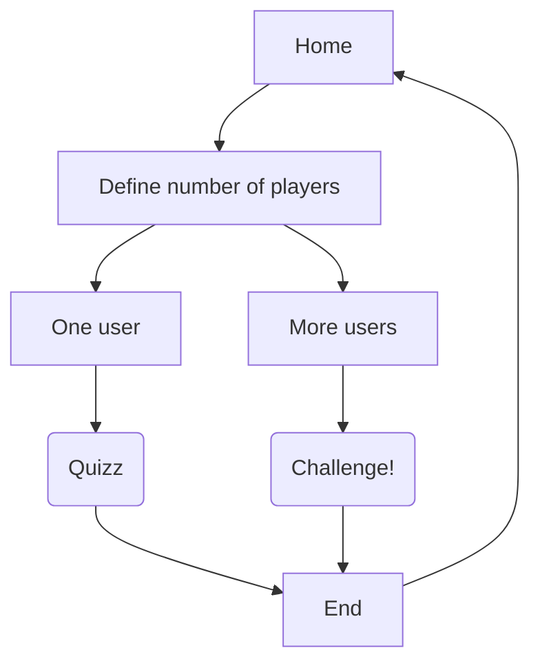

# Beat my neighbor !

BMN! est un jeu, permettant à des personnes de réaliser des paris météo.
De un à quatre joueurs, cette application se joue en local multi-player. C'est à dire, tous ensemble devant le même clavier.
Un peu semblable à un quizz, les joueurs devront sélectionner la réponse qui leur semble être la bonne parmi une liste de réponses possibles.

Techniquement, l'application est structurée en architecture 2-tiers.
D'un côté un front, gamifié pour les joueurs et connecté à une API.
L'autre, le back, consistant en une API permettant de générer les questions et stockant les résultats.

L'ensemble des données utilisées par l'application a été généré par un script python présent au sein du dépôt: [https://gitlab.com/docusland/python-weather-webservice](https://gitlab.com/docusland/python-weather-webservice)

Ce code a initiallement été réalisé par [EnzoKilm](https://github.com/EnzoKilm)

Il est possible également de modifier le code de ce script afin de générer les données autrement.

| Version | Author        | Description             |
| ------- | ------------- | ----------------------- |
| **0.1** | Erwann DUCLOS | Minimum Lovable Product |

[[_TOC_]]

## Interface

L'ensemble de l'application doit être responsive et avoir un aspect gamifié.

## Quizz

Si l'utilisateur souhaite jouer seul, il existe un mode quizz. Lui posant des questions génériques basées sur l'ensemble des données issues de la base de données.

Une suite de 10 questions lui seront posées.
L'utilisateur saisira sa réponse en cliquant sur des choix possibles.
En fin de partie, il pourra voir son ranking face à d'autres joueurs ayant joué précédemment.

Voici un exemple de questions posées :

- Le 6 mai, il a fait le plus "Sunny" au sein de quelle ville : <suggestion de villes>
- Quel a été le jour le plus chaud dans la ville de Toulouse ?
- Quel a été le jour le plus humide dans la ville de Rennes ?
- Quel a été le jour le moins chaud en France ?
- Quel mois y'as-t-il eu le plus de jours de beau temps successifs ?

Les questions sont générées depuis le Back end.
S'il s'agit d'un nouveau high score personnel, le joueur est notifié.

## Challenge

En mode challenge, il est attendu à ce que tous les joueurs soient face au même ordinateur. Ils joueront tout simplement à tour de rôle.

En début de partie, ils devront préciser leurs pseudos ainsi que leurs communes et le nombre de questions que durera ce challenge.

Les joueurs devront choisir des pseudo et des communes distinctes.
Les communes proposées devront correspondre à des communes présentes dans la base de données.

A chaque tour de jeu, une question leur sera posée et chaque joueur devra voter pour un symbole de météo.

Exemple de questions :

- Le 6 mai 2021 à 19h, quelle était la météo chez vous ?
- Au mois de mai, il y a eu une majorité de 'Cloudy'
- Dans vos communes respectives, en mai 2021, il a fait 'Cloudy' le plus chez qui ?
- Chez qui est-il le plus pertinent d'organiser les barbecues les dimanches midis?

Les questions proposées doivent être générées à partir des données qui sont en base.

Chaque question apporte des points aux joueurs.

Une fois que le nombre de questions est passé, les joueurs voient leurs scores et celui qui gagne.

## Barème approximatif

Ce barème est à titre approximatif.
N'oubliez pas un README pour décrire votre projet ainsi que pour préciser :

- Ce que fait ce projet
- Comment installer ce projet

| Description                                                    | Points |
| -------------------------------------------------------------- | ------ |
| Gestion de projet (git, kanban, issues, points avec formateur) | 3      |
| FRONT (Maquettes & UI / UX)                                    | 2      |
| FRONT - Esthétique, Responsive et gamification                 | 2      |
| FRONT - Structure component, stores                            | 2      |
| BACK - Structure de la data                                    | 3      |
| BACK - Pertinence de l'API                                     | 3      |
| Gestion des comptes utilisateurs                               | 2      |
| Propreté du code - optimisation / refactoring                  | 2      |
| Présence et pertinence du README                               | 1      |

Hormis cette répartition des points, des points bonus peuvent être attribués sur des sujets tiers. Consultez le formateur.

## Conclusion

Un plus serait de préciser la license associée à ce dépôt.

A vous les studios !
